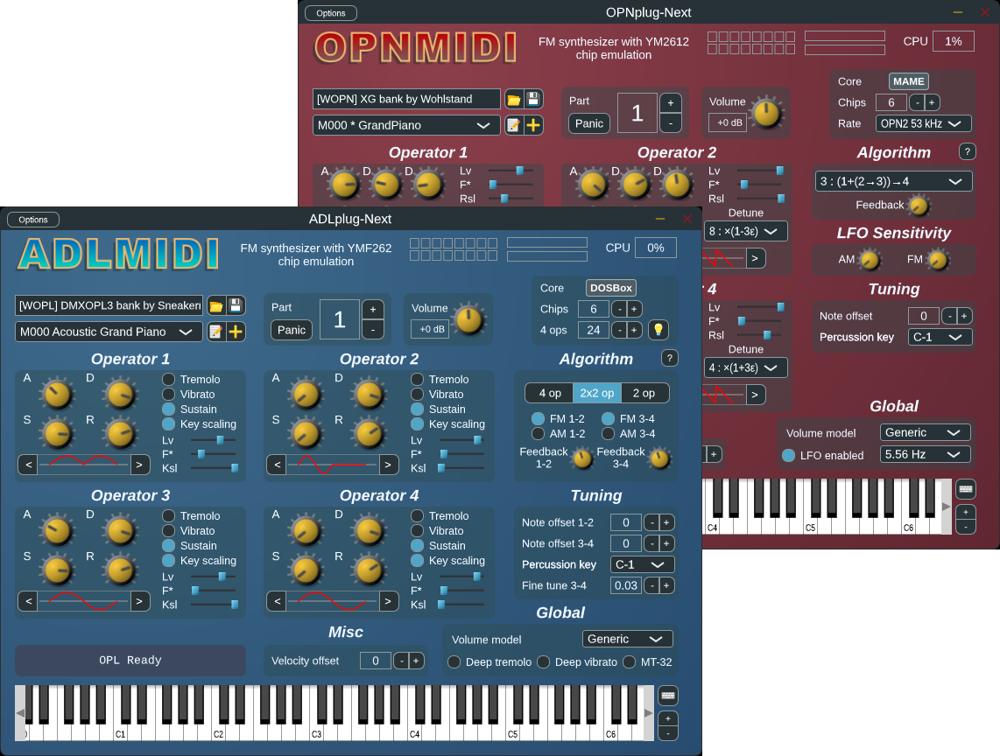

<!--
SPDX-FileCopyrightText: 2018-2021 Jean Pierre Cimalando
SPDX-FileCopyrightText: 2026 Yuma Kakei <yumasansansan@gmail.com>
SPDX-License-Identifier: BSL-1.0 AND GPL-3.0-or-later

このファイルは README.md の日本語版です．README.md は ADLplug から来たファイルを ADLplug-Next のために改めたものです．ADLplug は README.md に独自の表示を付けておらず，README.md は ADLplug のライセンスである Boost Software License 1.0（LICENSES/BSL-1.0.txt）の下にありました．SPDX の行は，著作権者とライセンスを REUSE 仕様の機械可読な形式で示しています．ADLplug の部分は Boost Software License 1.0 の下に，ADLplug-Next による変更は GNU General Public License バージョン 3 またはそれ以降のバージョン（LICENSES/GPL-3.0-or-later.txt）の下にあります．
-->

# ADLplug-Next
1980~90 年代を飾った YAMAHA の FM 音源チップを再現した，シンセサイザプラグインです（VST3，LV2，AU，AAX に対応，スタンドアロンでも動作します）．

[English](README.md) | 日本語



## 紹介

このソフト（ADLplug-Next／OPNplug-Next）は，音源チップ [OPL3](https://ja.wikipedia.org/wiki/YMF262) と [OPN2](https://ja.wikipedia.org/wiki/YM2612) を再現した，FM シンセサイザプラグインです．Jean Pierre Cimalando 氏により開発されていた [ADLplug](https://github.com/jpcima/ADLplug) の改造版です．
[libADLMIDI](https://github.com/Wohlstand/libADLMIDI) と [libOPNMIDI](https://github.com/Wohlstand/libOPNMIDI) の技術を用いています．

- [x] エミュレート（ソフトウェアで再現）した，複数の YMF262／YM2612 チップの制御
- [x] 忠実度の高いエミュレーションと，度合いの選択（良好な忠実度で高速か，極めて高い忠実度で低速かを選択できます）
- [x] 旋律楽器と打楽器の合成
- [x] 拡張可能な同時発音数
- [x] 同梱の音色コレクション
- [x] パラメータの動的な変更とオートメーションへの対応
- [x] MIDI 規格の厳密な実装
- [x] General MIDI 互換のマルチチャンネル動作
- [x] システムエクスクルーシブ（特定の機種向けの MIDI メッセージ）への対応（GM・GS・XG へのリセットと，マスターボリュームの設定）
- [x] MIDI ファイル全体を，そのまま合成できる機能

ADLplug-Next: DyTect（GitHub アカウント: [yumasansansan](https://github.com/yumasansansan)）  
アップストリーム（改造元）の ADLplug: 作者 [Jean Pierre Cimalando](https://github.com/jpcima)，貢献者 [Olivier Humbert](https://github.com/trebmuh)，[Christopher Arndt](https://github.com/SpotlightKid)，[Bruce Sutherland](https://github.com/bsutherland)，[David Runge](https://github.com/dvzrv)，[Jérémy Frey](https://github.com/jfrey-xx)

DyTect は，Yuma Kakei（GitHub では yumasansansan）のアーティスト名・エンジニア名です．Yuma Kakei は本名で，KDE プロジェクトでもこの名前で知られており，ADLplug-Next のコードの著作権表示にもこの名前が記されています．

## 開発版ビルド

[](https://github.com/yumasansansan/ADLplug-Next/actions/workflows/ci.yml)

リポジトリへのすべての push とプルリクエストは，GitHub Actions（GitHub 上で自動的にビルドやテストを行う仕組み）によって，Windows，Linux，macOS 上で，Debug と Release の両方でビルドされます．x86-64（Intel・AMD の 64 ビット CPU）向けには，すべての x86-64 CPU で動く版（baseline）と，AVX2 に対応した CPU 向けの版の，2 種類がビルドされます．

`main` ブランチへの push では，加えて Release ビルドのパッケージ化，rpm パッケージのビルド，一部のエミュレータコア（音源チップを再現するプログラム）を除いたビルドが行われます．すべてのジョブが成功すると，[Nightly](https://github.com/yumasansansan/ADLplug-Next/releases/tag/nightly) プレリリース（正式リリース前の，最新の開発版）が置き換えられます．各システム向けのアーカイブと，Ubuntu 向け，および RHEL・AlmaLinux・openSUSE 向けのパッケージが生成されます（[インストール方法](#インストール方法) を参照）．

最初のリリースまで，バージョンは 1.99.N です．N は，アップストリームの ADLplug の最後のコミット以降の，`main` ブランチのコミットの数です．プラグインには，コミットの日時（UTC）とハッシュも，`1.99.N+YYYYMMDD.HHMM.git<hash>` のように表示されます．マイナーバージョンが奇数のものは開発版です．

## インストール方法

[Nightly](https://github.com/yumasansansan/ADLplug-Next/releases/tag/nightly) プレリリースのアーカイブファイル（zip，tar.xz など）には，ADLplug-Next／OPNplug-Next の，両方のプラグインが入っています．名前に `avx2`，`amd64v3`，`x86_64_v3` を含むビルドには，AVX2（x86-64-v3）に対応した CPU が必要です（2026 年現在で，およそ 10 年以内の CPU は，おおむね対応しています）．対応していない CPU では，DAW などのホスト（プラグインを読み込むソフト）が，プラグインをスキャンする段階でもクラッシュします．

- Windows 11 以降（x86-64）: zip アーカイブを展開してください．プラグインとスタンドアロンのプログラムを動かすには，x64 用の [Microsoft Visual C++ 再頒布可能パッケージ](https://learn.microsoft.com/ja-jp/cpp/windows/latest-supported-vc-redist) が必要です．プラグイン（名前が `.vst3` などで終わるフォルダ）は，フォルダごと次の場所にコピーしてください．
  - `.vst3`: `C:\Program Files\Common Files\VST3`
  - `.lv2`: `C:\Program Files\Common Files\LV2` または `%APPDATA%\LV2`
  - `.aaxplugin`: `C:\Program Files\Common Files\Avid\Audio\Plug-Ins`
- macOS 26 以降（Apple Silicon）: zip アーカイブを展開してください．ファイルは Apple の公証（notarization，Apple によるマルウェアの確認）を受けていないため，そのままでは macOS に読み込みを止められることがあります．ターミナルで `xattr -dr com.apple.quarantine <展開したフォルダ>` を実行し，ダウンロード時に付いた検疫の属性（インターネットから入手したことを示す印）を取り除いてください．プラグインは，次の場所にコピーしてください．
  - `.vst3`: `~/Library/Audio/Plug-Ins/VST3`
  - `.component`（AU）: `~/Library/Audio/Plug-Ins/Components`
  - `.lv2`: `~/Library/Audio/Plug-Ins/LV2`
  - `.aaxplugin`: `/Library/Application Support/Avid/Audio/Plug-Ins`
- Ubuntu 26.04 以降: deb パッケージをインストールしてください（例: `sudo apt install ./adlplug-next_*_amd64.deb`）．`amd64v3` のパッケージは AVX2 版なので，AVX2 に対応した CPU でのみインストールしてください．
- RHEL 10 以降，AlmaLinux 10 以降，openSUSE: rpm パッケージをインストールしてください（例: `sudo dnf install ./adlplug-next-*.x86_64.rpm` または `sudo zypper install ./adlplug-next-*.x86_64.rpm`）．`x86_64_v3` のパッケージは AVX2 版なので，AVX2 に対応した CPU でのみインストールしてください．
- その他の Linux（x86-64）: tar.xz アーカイブを展開し，`.vst3` のフォルダを `~/.vst3` に，`.lv2` のフォルダを `~/.lv2` にコピーしてください．

Linux では，画面の表示に X11 を使います（Wayland の環境でも，Xwayland を通して表示されます）．AAX プラグインには PACE 社による署名がないため，Pro Tools Developer でのみ読み込むことができます．各アーカイブとパッケージには，プラグインのライセンスの文書と，音色バンク（音色をまとめたデータ）の利用条件を記した `<プラグイン名>-banks.txt`（`ADLplug-Next-banks.txt` など）が含まれています．

## ADLplug からの移行

ADLplug-Next と OPNplug-Next は，ADLplug や OPNplug とは別のプラグインです．異なる名前・メーカー名・識別子をもつため，両方インストールすることができます．
- VST3 プラグインは，ADLplug と OPNplug の VST2・VST3 プラグインとの互換性が保たれています．対応した DAW などのホストでは，それらを使っていたプロジェクトを ADLplug-Next や OPNplug-Next でそのまま開くことができます．
- AU（Logic Pro など）と LV2 のホストでは，別のプラグインに見えます．
- プラグインは，ADLplug-Next／OPNplug-Next 自身の設定がまだなければ ADLplug や OPNplug の設定（キーボード配列と，最後に使った音色のディレクトリ）を読み込み，保存は自分自身の設定に行います．

## リンク集

- ADLplug のユーザーマニュアル: [英語 :us:](http://jpcima.sdf1.org/software/documentation/ADLplug/manual/en/manual.html) [フランス語 :fr:](http://jpcima.sdf1.org/software/documentation/ADLplug/manual/fr/manual.html)
- アップストリームの ADLplug のパッケージ:
  - LibraZiK-2: [ADLplug :fr:](https://librazik.tuxfamily.org/doc2/logiciels/adlplug) [OPNplug :fr:](https://librazik.tuxfamily.org/doc2/logiciels/opnplug)
  - Fedora Copr: [ycollet/linuxmao](https://copr.fedorainfracloud.org/coprs/ycollet/linuxmao/)
  - Arch Linux AUR: [adlplug-git](https://aur.archlinux.org/packages/adlplug-git/) と [opnplug-git](https://aur.archlinux.org/packages/opnplug-git/)
- バンクエディタ（音色バンクを編集するソフト）: [OPL3](https://github.com/Wohlstand/OPL3BankEditor) と [OPN2](https://github.com/Wohlstand/OPN2BankEditor)

## FM 音源コアの特徴

エミュレータコア（以下，コア）は，音源チップの動作をソフトウェアで再現するプログラムです．同じチップでも，コアによって音の正確さや処理の重さが異なり，プラグインのエミュレータメニューで切り替えることができます．

ADLplug-Next は，libADLMIDI と libOPNMIDI が提供するすべてのエミュレータコアをビルドします．動作に必須なものを除いては，どのコアも，ビルドオプションで除くことができます（[ビルド方法](#ビルド方法) を参照）．コアの名前はプラグインのエミュレータメニューに表示されるもので，備考は，ライブラリとコアが自身について説明している内容をまとめたものです．

表の*速度*は，Intel Core i7-1360P で，1 つのチップに 9 音を 44.1 kHz で鳴らしたときに，リアルタイムの何倍の速さで処理できたかを表します（`-O3` でビルドしたもの）．たとえば 100× なら，1 秒分の音を 0.01 秒で作ることができます．1 つのインスタンス（DAW で読み込んだプラグイン 1 つ）は，デフォルトで 2 つのチップを動かします．*フルパンニング*に対応したコアでは，音を左右の好きな位置に置くことができます．対応していないコアでは，左・中央・右のいずれかにしか置けません．OPL2 はモノラルなので，左右の区別がありません．

低レベル（LLE）のコアは，チップの内部を撮影した写真（ダイ写真）から読み取った回路を再現します．最も忠実ですが，処理がとても重く，ほとんどのコンピュータではリアルタイムで演奏することができません．DAW で音声ファイルに書き出す（レンダリングする）ときに使ってください．

**ADLplug-Next**

| コア | チップ | 備考 | 速度 | フルパンニング | ビルドオプション |
|------|--------|------|-----:|----------------|------------------|
| DOSBox 0.74-r4111 OPL3（デフォルト） | OPL3（YMF262） | 正確で高速（libADLMIDI の説明） | 346× | あり | `USE_DOSBOX_EMULATOR`，必須 |
| Nuked OPL3 (v 1.8) | OPL3（YMF262） | 非常に正確だが，より多くの CPU パワーを要する（libADLMIDI の説明） | 57× | あり | `USE_NUKED_EMULATOR` |
| Nuked OPL3 Fast (by tgies) | OPL3（YMF262） | Nuked OPL3 を高速化した派生版（フォーク）で，出力はビット単位で同一．Nuked OPL3 1.7.4 の代わりに入っている | 73× | あり | `USE_NUKED_EMULATOR` |
| YMFM OPL3 | OPL3（YMF262） | ビット単位の正確さより，耳で区別できないことを，妥当な速度で目指す（ymfm の説明） | 101× | なし | `USE_YMFM_EMULATOR` |
| Opal OPL3 | OPL3（YMF262） | 不正確（libADLMIDI の説明）．Reality Adlib Tracker の曲のために書かれ，パーカッションモードがない | 109× | あり | `USE_OPAL_EMULATOR` |
| Java 1.0.6 OPL3 | OPL3（YMF262） | 部分的に正確（libADLMIDI の説明） | 76× | あり | `USE_JAVA_EMULATOR` |
| YMF262-LLE OPL3 | OPL3（YMF262） | 低レベル．一般的な CPU には重すぎる（libADLMIDI の説明） | 1.7× | なし | `USE_NUKED_OPL3_LLE_EMULATOR` |
| DOSBox 0.74-r4111 OPL2 | OPL2（YM3812） | DOSBox のコアを OPL2 として動かしたもの | 515× | モノラル | `USE_DOSBOX_EMULATOR` |
| MAME OPL2 | OPL2（YM3812） | MAME の YM3812 コア | 214× | モノラル | `USE_MAME_EMULATOR` |
| YMFM OPL2 | OPL2（YM3812） | YMFM OPL3 と同様 | 184× | モノラル | `USE_YMFM_EMULATOR` |
| Nuked OPL2 Lite | OPL2（YM3812） | Nuke.YKT 氏によるもの，バージョン 0.9 beta | 88× | モノラル | `USE_NUKED_EMULATOR` |
| YM3812-LLE OPL2 | OPL2（YM3812） | YMF262-LLE と同様 | 3.5× | モノラル | `USE_NUKED_OPL2_LLE_EMULATOR` |
| ESFMu | ESFM（ESS） | ESS 社の，OPL3 を拡張した互換チップを，Nuked OPL3 をもとに再現したもの．libADLMIDI では OPL3 として鳴らす | 9.7× | あり | `USE_ESFMU_EMULATOR` |
| Nuked CQM | CQM（Creative） | Creative 社による OPL3 の互換チップ．Nuke.YKT 氏によるもの，バージョン 0.9 beta | 22× | なし | `USE_NUKED_EMULATOR` |

**OPNplug-Next**

| コア | チップ | 備考 | 速度 | フルパンニング | ビルドオプション |
|------|--------|------|-----:|----------------|------------------|
| MAME YM2612（デフォルト） | OPN2（YM2612） | 正確で，遅いデバイスでも高速（libOPNMIDI の説明） | 247× | あり | `USE_MAME_EMULATOR`，必須 |
| Nuked OPN2 (2612) | OPN2（YM2612） | 非常に正確だが，非常に高性能な CPU を要する（libOPNMIDI の説明） | 21× | あり | `USE_NUKED_EMULATOR` |
| Nuked OPN2 (3438) | OPN2C（YM3438） | 同じコアを YM3438 として動かしたもの | 21× | あり | `USE_NUKED_EMULATOR` |
| GENS/GS II OPN2 | OPN2（YM2612） | 最も高速だが，非常に古く不正確（libOPNMIDI の説明） | 321× | あり | `USE_GENS_EMULATOR` |
| YMFM OPN2 | OPN2（YM2612） | YMFM OPL3 と同様 | 107× | あり | `USE_YMFM_EMULATOR` |
| YM2612-LLE OPN2 | OPN2（YM2612） | 低レベル．非常に正確だが，遅いマシンではレンダリングにしか使えないほど重い（libOPNMIDI の説明） | 1.4× | なし | `USE_NUKED_OPN2_LLE_EMULATOR` |
| YM3438-LLE OPN2 | OPN2C（YM3438） | YM2612-LLE と同様 | 2.3× | なし | `USE_NUKED_OPN2_LLE_EMULATOR` |
| YMF276-LLE OPN2 | OPN2L（YMF276） | YM2612-LLE と同様 | 2.0× | なし | `USE_NUKED_OPN2_LLE_EMULATOR` |
| MAME YM2608 | OPNA（YM2608） | 正確で，遅いデバイスでも高速（libOPNMIDI の説明） | 175× | あり | `USE_MAME_2608_EMULATOR` |
| Neko Project II Kai OPNA | OPNA（YM2608） | 部分的に正確で，遅いデバイスで高速（libOPNMIDI の説明）．SSG-EG は libOPNMIDI による実験的な追加 | 325× | あり | `USE_NP2_EMULATOR` |
| YMFM OPNA | OPNA（YM2608） | YMFM OPL3 と同様 | 66× | なし | `USE_YMFM_EMULATOR` |
| YM2608-LLE OPNA | OPNA（YM2608） | YM2612-LLE と同様 | 0.3× | なし | `USE_NUKED_OPNA_LLE_EMULATOR` |

## ビルド方法

ここからは，ソースコードからプラグインをビルドする方法の説明です．配布されているプラグインを使うだけなら，[インストール方法](#インストール方法) を参照してください．

ADLplug-Next は Windows 11 以降（x86-64），Ubuntu 26.04 以降（x86-64），および macOS 26 以降（Apple Silicon）に対応しています．Linux では，JUCE（プラグインの開発に使っているフレームワーク）に Wayland 用のバックエンドがないため，X11 上で動作します（Wayland セッションでは，XWayland 上で動作します）．

次の依存関係（ビルドに必要なソフトウェア）をインストールしてください．
- CMake 3.29 以降と Ninja
- LLVM 19 以降（C23 / C++23 のため）: Clang，LLD，`llvm-ar`，`llvm-ranlib`，Windows では `llvm-rc`，そしてプロファイルに基づく最適化（PGO）のために `llvm-profdata` と compiler-rt のプロファイル用ランタイム（`libclang-rt-<version>-dev`）が必要です．これらはすべて，同じバージョンでなければなりません．ビルド前の Configuration でチェックされます．GCC や GNU binutils，MSVC の cl.exe，link.exe などは対応していません．なお，CI（GitHub Actions による自動ビルド）は LLVM 23 によりビルドされているので，LLVM 23 を推奨します．
- Windows: MSVC のライブラリと，Windows SDK が必要です．Visual Studio（C++ によるデスクトップ開発）に同梱されているので，インストールしてください．Visual Studio 2026 を推奨します．
- Linux: ALSA，FreeType，Fontconfig，X11 の `-dev` パッケージが必要です．Ubuntu では，`libasound2-dev libfontconfig1-dev libfreetype-dev libx11-dev libxcomposite-dev libxcursor-dev libxext-dev libxi-dev libxinerama-dev libxrandr-dev libxrender-dev` をインストールしてください．
- macOS: Xcode（SDK のため）と，LLVM の Clang と LLD（Xcode に付属する Apple のものではないもの）が必要です．プラグインは macOS に入っている libc++ を使うため，LLVM に付属する libc++ のヘッダではなく，SDK の libc++ のヘッダを使ってコンパイルしてください（CI での設定方法は `ci/setup.sh` を参照してください）．

### コンパイル

以下のコマンドを実行すると，ADLplug-Next がビルドされます．

```
git clone --recursive https://github.com/yumasansansan/ADLplug-Next.git
cd ADLplug-Next
cmake --preset adl-release     # OPNplug-Next をビルドする場合は opn-release を指定してください．*-relwithdebinfo，*-debug はデバッグ向けです．
cmake --build --preset adl-release     # 上と同様です．
```

`CMakePresets.json` に書かれているプリセット（あらかじめ用意されたビルドの設定）は，Windows，Linux，macOS のどれでも動作します．Clang，LLD（`CMAKE_LINKER_TYPE=LLD`）といった LLVM のツールチェーンと，Ninja が指定されています．バージョンは固定されていませんが，LLVM 23 を推奨します．なお，以下のオプションを `cmake` に渡すと，コンパイルの設定をカスタマイズできます．

また，構成時に `patches/` にあるパッチがサブモジュールに適用されます．同梱しているライブラリと JUCE に見つかった不具合を，ADLplug-Next が直したものです．それぞれ元のプロジェクトにも提出しており，取り込まれたものは削除します．なお，パッチを適用するとサブモジュールに変更が入るため，`git status` に表示されます．

オプションで，ADLplug-Next をビルドするか，OPNplug-Next をビルドするかを切り替えることができます．
- OPL3 版（ADLplug-Next）をビルドするには，オプション `ADLplug_CHIP` を `OPL3` に設定します．
- OPN2 版（OPNplug-Next）をビルドするには，オプション `ADLplug_CHIP` を `OPN2` に設定します．

| ビルドオプション                   | デフォルト                               | 説明                                                             |
| ------------------------------- | -------------------------------------- | ---------------------------------------------------------------- |
| -DADLplug_VST3=ON/OFF           | ON                                     | VST3 プラグインをビルドする                                          |
| -DADLplug_LV2=ON/OFF            | ON                                     | LV2 プラグインをビルドする                                           |
| -DADLplug_AU=ON/OFF             | ON（macOS），OFF（その他）                | AU プラグインをビルドする（Logic Pro 向け，macOS のみ対応）            |
| -DADLplug_AAX=ON/OFF            | ON（Windows，macOS），OFF（その他）       | AAX プラグインをビルドする（Pro Tools で読み込むには PACE 社による署名が必要です） |
| -DADLplug_Standalone=ON/OFF     | ON                                     | スタンドアロンのプログラムをビルドする                                       |
| -DADLplug_ASIO=ON/OFF           | ON（Windows），OFF（その他）              | スタンドアロンプログラムで ASIO を有効にする（Windows のみ対応）         |
| -DADLplug_CHIP=OPL3/OPN2        | OPL3（opn-* プリセットを指定すると，OPN2 に設定されます） | ADLplug-Next（OPL3）をビルドするか，OPNplug-Next（OPN2）をビルドするかを切り替える |
| -DADLplug_GREYZONE_BANKS=ON/OFF | OFF                                    | グレーゾーンのバンクを含める（後述） |
| -DADLplug_ARCH=baseline/avx2    | baseline                               | x86-64 の命令セット（baseline はすべての x86-64 CPU 向け，avx2 は AVX2 に対応した CPU 向け） |
| -DADLplug_PGO=ON/OFF            | ON                                     | Release ビルドで，プロファイルに基づく最適化（PGO）を行う（後述） |
| -DADLplug_SANITIZERS=<list>     | 空                                     | サニタイザ付きでビルドする（address・undefined・vptr をカンマ区切りで指定，後述） |
| -DADLplug_ASSERTIONS=ON/OFF     | OFF                                    | ビルドの種類（Debug・Release など）にかかわらず，アサーション（内部の整合性のチェック）を有効にする |
| -DADLplug_WERROR=ON/OFF         | OFF（プリセットでは ON に設定されています）  | ADLplug-Next 自身のコードの警告をエラーとして扱う |
| -DADLplug_BUILD_TOOLS=ON/OFF    | OFF                                    | 開発者向けのツール（VST3 プラグインを読み込んで，音を書き出すツール）をビルドする |
| -DADLplug_BUILD_TESTS=ON/OFF    | OFF                                    | テストをビルドし，CTest（CMake のテストを実行するツール）に登録する |
| -DADLplug_BUILD_FUZZERS=ON/OFF  | OFF                                    | fuzz（自動で作った入力で不具合を探すテスト）の対象を，libFuzzer 付きでビルドする（Linux のみ，後述） |
| -DADLplug_INSTALL_VST3DIR=<dir> | lib/vst3                               | VST3 プラグインの，インストール先ディレクトリ（Linux） |
| -DADLplug_INSTALL_LV2DIR=<dir>  | lib/lv2                                | LV2 プラグインの，インストール先ディレクトリ（Linux） |

`ADLplug_PGO` を有効にすると，Release ビルドはコンパイルの前に学習（プロファイルの取得）を行います．ビルドディレクトリの `pgo/instrumented` に，オフラインレンダラと，プロファイル（どの処理がよく使われるかを計測したデータ）を取るためのコードを埋め込んだ VST3 プラグインをビルドし，ビルドに含まれるすべてのエミュレータコアでレンダリングして，そのプロファイルを使ってプラグインをコンパイルします．プロファイルを作り直すのは，プラグインが変わったときだけになります．`llvm-profdata` と LLVM の compiler-rt のプロファイル用ランタイム（apt.llvm.org では `libclang-rt-<version>-dev` パッケージに含まれます）に加えて，ビルドしたプラグインを実行できるマシンが必要です．AVX2 のない CPU で AVX2 版をビルドするときや，ビルドを速く済ませたいときは，無効にしてください．

`ADLplug_SANITIZERS` を指定すると，ADLplug-Next 自身のコード，JUCE，ライブラリのすべてを，指定したサニタイザ付きでビルドします．未定義の操作が見つかった時点で止まります．`adl-sanitize`・`opn-sanitize` のプリセットが，address・undefined・vptr のサニタイザと RelWithDebInfo を指定します（例: `cmake --preset adl-sanitize`）．vptr は，オブジェクトが，コードの想定しているクラスのものであるかを確かめる検査で，undefined には含まれません．Windows の Clang にはないため，Windows ではこれを除いてビルドします．誤りを見つけるためのビルドなので，演奏には向きません．動作は数倍遅くなります．

エミュレータコアは，デフォルトですべてビルドされます．コアを除くには，[FM 音源コアの特徴](#fm-音源コアの特徴) の表の「ビルドオプション」の列にあるオプションを OFF にします（例: `-DUSE_OPAL_EMULATOR=OFF`）．`USE_NUKED_EMULATOR` のように，1 つで複数のコアをまとめて除くオプションや，libADLMIDI と libOPNMIDI の両方にある名前のオプションもあります．両方にある名前でも，影響するのはビルドするプラグインの側（ADLplug-Next なら libADLMIDI）だけです．`USE_DOSBOX_EMULATOR`（ADLplug-Next）と `USE_MAME_EMULATOR`（OPNplug-Next）は，プラグインが音色の計測に使うため，OFF にすることはできません（configure の時点でエラーになります）．

除いたコアを使って保存したプロジェクトは，そのビルドでは，同じチップのデフォルトのコアで鳴ります．コアの選択は保存されたままなので，そのコアを含むビルドで開くと，再びそのコアで鳴ります．

### 音色バンク

プラグインに入っている音色バンク（音色をまとめたデータ）は，ビルドのときに `tools/bankgen` が，`thirdparty/` にあるサブモジュール（取り込んでいる外部のリポジトリ）のファイルから作ります．
- ADLplug-Next: libADLMIDI に含まれるバンクを，libADLMIDI の `banks-no-grey.ini` の一覧に従って，WOPLX ファイル（libADLMIDI のバンクの形式）から取り込みます（同じファイルは 1 回だけ）．
- OPNplug-Next: `resources/opn2/banks.ini` の一覧にあるバンクを取り込みます．libOPNMIDI の WOPN バンクと，OPN2 Bank Editor に付属するサンプルの GYB・GEMS バンクで，GYB・GEMS バンクは，OPN2 Bank Editor で読み込んだときと同じように変換されます．

libADLMIDI には，作者の明示的な許可なく作られ，法的な位置付けがはっきりしない「グレーゾーン」なバンクがあり，代替も用意されています．`-DADLplug_GREYZONE_BANKS=ON` を指定しない限り，グレーゾーンを含めずにビルドされます．指定すると，ADLplug-Next は代わりに libADLMIDI の `banks.ini` を使い，OPNplug-Next はリスト（`resources/opn2/banks.ini`）でグレーゾーンとされているバンク（ライセンスも作者の許可も知られていないもの）も取り込みます．Releases で配布されているバイナリは，グレーゾーンを含めずにビルドされています．

各バンクには，作者や利用条件など，元のファイルに記されている情報が含まれます．この情報は，プラグインの画面でバンクを読み込むメニューの「Bank information...」から表示することができます．また，ビルドすると，すべてのバンクの情報が，ビルドディレクトリの `banks/<プラグイン名>-banks.txt` に書き出されます．

### テスト

テストを実行するには，テストと開発者向けのツールを有効にして configure（CMake による構成）を行い，ビルドしてから CTest を実行します．

```
cmake --preset adl-debug -DADLplug_BUILD_TESTS=ON -DADLplug_BUILD_TOOLS=ON
cmake --build --preset adl-debug
ctest --preset adl-debug
```

- ユニットテスト（`tests/unit`）: ADLplug-Next 自身の共通の処理と，プラグインに入っているバンクを確認します．`bankgen.greyzone` は，グレーゾーンのバンクも含めて生成し，GYB・GEMS バンクの変換など，それらのバンクでしか使われない処理を確認します．
- レンダリングテスト: VST3 プラグインを `tools/render` に読み込んで，決まった MIDI のシーケンスを演奏させ，出力を `tests/render/references.txt` と比べます．ほかにも，次のことを確認します．
  - エディタを開いたり，保存した状態を復元したりしても，出力が変わらないこと
  - プラグインが再び準備（prepare）されても，パラメータと状態が保たれること
  - VST3 プラグインが，アップストリームの ADLplug と同じパラメータ ID を使っていること
  - Release ビルドで，すべてのエミュレータコアが音を出すこと
  - 一部のコアを除いたビルドで，除いたコアを指定すると，代わりのコアが鳴ること
- fuzz のテスト（`fuzz/`）: プラグインの外から来る入力を扱う処理に，過去に不具合を起こした入力と，それ以外の入力を与えます．
  - バンクと楽器のファイル: libADLMIDI・libOPNMIDI・OPN2 Bank Editor に付属するバンクと楽器も与えて，読み込んで保存し直したファイルが同じ内容で読み込めることを確認します．
  - ホストから来る MIDI: プロジェクトが持つチップの設定と合わせて与え，すべてのエミュレータコアで音が鳴り，出てくる標本がすべて有限の値であることを確認します．
  - プロジェクトにホストが保存した状態: どんな状態を与えても，そのあとプラグインが書き出すのは自分の状態で，それを開いて保存し直しても変わらないことを確認します．
  - プラグインが読み込まれている間にホストがすること: バッファに入れる MIDI，パラメータに書くオートメーション，要求してくるブロックを与え，出てくる標本がすべて有限の値であること，そしてプラグインが数えているチャンネルごとの発音数が，そのチャンネルで鳴っているとプラグインが思っている音の数と一致することを確認します．
  - プラグインが長さを測る楽器: ホストに音の終わりを伝えるための測定で，返ってくる数がすべて有限で，鳴らして聴いた時間より長い時間を申告しないことを確認します．
- configure のときに [pluginval](https://github.com/Tracktion/pluginval) や [lv2lint](https://git.open-music-kontrollers.ch/~hp/lv2lint)（プラグインの検証ツール）が `PATH` にあれば，それらを使って VST3・LV2 プラグインも検証します．

同じ fuzz の対象は，[libFuzzer](https://llvm.org/docs/LibFuzzer.html)（入力を自動で作り出し，それまでどの入力も通らなかったコードに届いたものを残していく fuzz のツール）付きでもビルドできます．Linux で，サニタイザと組み合わせて使います（Windows 版の LLVM の libFuzzer は，プラグインとリンクできません）．ADLplug-Next の場合の例です．

```
cmake --preset adl-sanitize -DADLplug_BUILD_FUZZERS=ON
cmake --build --preset adl-sanitize --target ADLplug_fuzz_bank_file
mkdir -p corpus
build/adl-sanitize/fuzz/ADLplug_fuzz_bank_file -dict=fuzz/dict/wopl.dict corpus thirdparty/libADLMIDI/fm_banks/wopl_files
```

不具合を起こす入力が見つかるか，止められるまで動き続けます（`-max_total_time=<秒数>` で時間を区切れます）．見つかった入力は `crash-<ハッシュ>` という名前のファイルに書き出されます．その入力は，修正と一緒に `fuzz/regressions/opl3/<対象名>`（OPNplug-Next では `opn2`）に加えてください．以後，テストでその入力が再生されます．

残る 4 つの対象は，MIDI を鳴らす `ADLplug_fuzz_midi_synth`，プロジェクトにホストが保存した状態を読む `ADLplug_fuzz_state`，ホストと同じようにプラグインを動かす `ADLplug_fuzz_host`，そして楽器の長さを測る `ADLplug_fuzz_measurement` です．前の 3 つは種の入力を CMake が書き出すので（MIDI の方は，ビルドしたコアごとに 1 つずつ）ビルドディレクトリから渡し，最後の 1 つは `fuzz/seeds/` にあります．

```
cmake --build --preset adl-sanitize --target ADLplug_fuzz_midi_synth
build/adl-sanitize/fuzz/ADLplug_fuzz_midi_synth -dict=fuzz/dict/midi.dict corpus build/adl-sanitize/fuzz/seeds/midi_synth
cmake --build --preset adl-sanitize --target ADLplug_fuzz_state
build/adl-sanitize/fuzz/ADLplug_fuzz_state -dict=fuzz/dict/state.dict corpus build/adl-sanitize/fuzz/seeds/state
cmake --build --preset adl-sanitize --target ADLplug_fuzz_host
build/adl-sanitize/fuzz/ADLplug_fuzz_host -dict=fuzz/dict/host.dict corpus build/adl-sanitize/fuzz/seeds/host
cmake --build --preset adl-sanitize --target ADLplug_fuzz_measurement
build/adl-sanitize/fuzz/ADLplug_fuzz_measurement -dict=fuzz/dict/measurement.dict corpus fuzz/seeds/opl3/measurement
```

楽器 1 つの測定は 100 秒ぶんの音を鳴らすので，この対象は push ごとの 1 分の fuzz からは外してあり，毎日の fuzz で回ります．入力の再生テストは，他と同じようにすべての環境で走ります．

エディタのテストはウィンドウを開くため，Linux では，ウィンドウマネージャ（ウィンドウを管理するソフト）のある X11 の画面が必要です（通常のデスクトップ環境なら，Xwayland 上で動きます）．ウィンドウマネージャがないと，lv2lint はエディタで起きる X のエラーで止まります．

### ビルドしたプラグインのインストール

Linux では，`cmake --install` で，ビルドしたプラグインなどをインストールすることができます（`--prefix` でインストール先を指定します）．

```
sudo cmake --install build/adl-release --prefix /usr/local
```

プラグインは，インストール先の `lib/vst3` と `lib/lv2` に入ります（上の例では `/usr/local/lib/vst3` と `/usr/local/lib/lv2`）．RHEL や openSUSE のように，ライブラリを `lib64` に置くシステムでは，LV2 のホストが `lib64/lv2` を探すため，`-DADLplug_INSTALL_LV2DIR=lib64/lv2` を指定して configure してください．Windows と macOS では，`build/<プリセット名>/ADLplug_artefacts/Release` にできたプラグインを，[インストール方法](#インストール方法) の説明に従ってコピーしてください．

### 変更履歴

**dev**

- 一部のプラグインホストで，状態の再読み込みがうまくいかない問題を修正
- 必要なプラットフォームで，pthread をリンクするよう変更
- Windows で，ユーザーインターフェースが CPU を 100% 使う問題を修正

**1.0.2**

- Bruce Sutherland 氏によるユーザーマニュアルの英訳を追加
- KSL の編集の挙動を，減衰量に対して線形になるよう変更
- システムの libfmt とリンクするビルドオプションを追加
- char 型が符号なしの環境でも，リソースシステムが動くよう修正

**1.0.1**

- Wohlstand 氏による OPN 用の XG バンクを，新しい打楽器を加えて更新
- 状態を扱う仕組みを，部分的に作り直し
- Audio Unit 版を初めて追加（まだ検証には通らない）

**1.0.0**

- Robson Cozendey 氏による Java OPL3 エミュレータを追加
- Reality Adlib Tracker の Opal OPL3 エミュレータを追加
- キーをすぐに離したときに，打楽器が鳴らない問題を修正
- 仮想キーボードで，ドラムセット全体を演奏できるよう変更
- 旋律楽器のチャンネルで打楽器を，打楽器のチャンネルで旋律楽器を選べないよう変更
- コンボボックスの上でスクロールホイールを回して，プログラムを切り替えられるよう変更
- 段階的な値をとるコントロールで，スクロールホイールの刻みを 1 に制限
- ノブとスライダーに，正確な値を表示
- リズムモードのチャンネルを使うバンクファイルに対応
- 伸ばしている音が多いときの，チャンネル管理を効率化
- ホールドペダルを使い，チャンネルプレッシャーが高いときに，まれに起きる致命的なエラーを修正
- 再ビルドを速くするため，独自のリソースシステムを実装
- ユーザーインターフェースを細かく変更

**1.0.0.beta.5**

- 新しいチップとして，Neko Project II Kai のエミュレーションによる YM2608（OPNA）を追加
- 新しいエミュレータとして，MAME YM2608 を追加
- OPN2 と OPNA の音色に合わせて，チップのレートを選べるよう変更
- プログラムの選択，パートの選択，バンク名の保存・復元に対応
- Non セッション管理の機能 `optional-gui`，`switch` を追加
- ホストに見せるパラメータを減らし，ホストでの動作を軽くするよう変更
- 画面上での，OPN のレベルの扱いの誤りを修正
- Steinberg SDK の代わりに VeSTige を使って，VST2 版をビルドできるよう変更
- JACK スタンドアロンに，コマンドラインのフラグ `--version` を追加
- JACK スタンドアロンに，ウィンドウアイコンを追加
- macOS のスタンドアロンを，アプリ（.app）としてビルドするよう変更

**1.0.0.beta.4**

- マスターボリュームのコントロールを追加
- SBI 形式の音色の読み込みに対応
- Non セッションマネージャに対応
- 初期化の順序の誤りで，状態の読み込みのフォールバック（代わりの読み込み方法）が失敗することがある問題を修正
- 一部のホストで，エディタを閉じて開き直したあとの状態を修正
- 旋律楽器か打楽器のバンクを含まない，保存したバンクを再読み込みできるよう修正
- バンク全体を削除する機能を追加
- 音色のディレクトリを，次に使うときまで記憶するよう変更
- OPN2 のバンクコレクションを更新

**1.0.0.beta.3**

- バンクとプログラムの追加・削除・名前の変更に対応
- Unicode 文字を含む拡張キーマップに対応
- シンセサイザの準備より前に状態が復元されたとき，起動時にクラッシュする問題を修正
- OPN2 のソフトパンニングに対応
- MIDI のプログラムチェンジを受け取ったあと，パラメータが同期されないことがある問題を修正

**1.0.0.beta.2**

- JACK 専用のスタンドアロンに，システムの出力へ自動で接続するコマンドラインのフラグ `-a` を追加
- freedesktop のショートカットとアイコンを追加
- QWERTY 以外のキーボード配列に対応
- キーボードのオクターブの設定に対応
- MIDI 入力で演奏された鍵盤を，強調表示するよう変更
- プログラムの選択が，MIDI のプログラムチェンジに追従するよう変更
- GNU の標準のインストール先ディレクトリへのインストールに対応
- [Open Source Music FM Synthesizer Challenge](https://fmchallenge.osamc.de/fmsynths/) に選ばれました！ :tada:

**1.0.0.beta.1**

- OPN2 の合成に，別のプラグインとして対応
- プラグインの状態が不完全に保存される問題を修正
- ファイル選択画面での，OPN2 バンクファイルの拡張子を修正

**1.0.0.alpha.3**

- バッファサイズが大きいときの，MIDI のレイテンシ（遅延）を補正
- 4 オペレータのチャンネルマップの管理の誤りを修正
- 長く何も鳴らなかったあとに，チャンネルの割り当てが悪くなることがある問題を修正
- 内部のタイミングの精度を改善
- 現在の状態の保存・復元に対応
- 多数の内蔵バンクを追加
- ユーザーインターフェースを，さまざまな点で改善

## ライセンス

ADLplug-Next は，全体として **GNU General Public License v3**（GPLv3）で配布されています（`LICENSE` を参照）．ADLplug-Next は，いくつかの異なる自由ソフトウェアライセンスのコードを組み合わせてできており，全体には，その中で最も制約の強いライセンスが適用されます．

ADLplug-Next のために書かれたコード（新しいファイルと，ADLplug から来たファイルに加えた変更）は，**GPLv3-or-later**（GPLv3，またはそれ以降のバージョン）でライセンスされています．このコードの著作権者は，Yuma Kakei（GitHub では yumasansansan）です．

元の ADLplug のために開発された部分は，引き続き，その作者から **Boost Software License 1.0**（`LICENSES/BSL-1.0.txt` を参照）の下で利用することができます．`sources/` にある Boost の表示は，このライセンスのことです．Boost Software License は GPL と両立するため，これらの部分は，表示をそのまま残せば，ADLplug-Next の一部として再配布することができます．

すべてのファイルに，著作権者とライセンスを [REUSE 仕様](https://reuse.software/spec-3.3/) の形式（機械で読み取ることができる形式）で記しています．ふつうはファイルの先頭のコメントに書き，画像やフォントのようにコメントを書けないファイルについては，`REUSE.toml` に書いています．ADLplug から来たファイルは元の表示を残し，ADLplug の部分と ADLplug-Next で変えた部分を，ヘッダで区別しています．ライセンスの全文は `LICENSES/` にあり，CI では `reuse lint` ですべてのファイルを確認しています．

配布されているバイナリ（ビルド済みのプラグインやプログラム）は，GPLv3-or-later ではなく，GPLv3 で配布されています．理由は次のとおりです．
- 同梱の ASIO SDK と AAX SDK は，GPLv3 で利用することができますが，GPLv3-or-later ではありません．
- JUCE は，2 つのライセンス（デュアルライセンス）のうち，**AGPLv3** を選んで使っています．

GPLv3 の第 13 条は，GPLv3 の著作物と AGPLv3 の著作物を組み合わせることを明示的に認めていて，その場合，組み合わせたものには，AGPLv3 のネットワーク越しのやり取りに関する条項が適用されます．オーディオプラグインでは実際上の影響はありませんが，このため，バイナリを「GPLv3 のみ」と表現することはできません．

| ファイル | ライセンス |
| -------- | ---------- |
| `sources/`，`tools/` — ADLplug-Next のコード | GNU GPL v3 以降 |
| `sources/` — 元の ADLplug の部分 | Boost Software License 1.0（以下に記すものを除く） |
| `thirdparty/JUCE` | GNU AGPL v3（または商用ライセンス） |
| `thirdparty/JUCE` — 同梱の ASIO SDK | Steinberg ASIO License **または GNU GPL v3** |
| `thirdparty/JUCE` — 同梱の AAX SDK | Avid AAX SDK License **または GNU GPL v3** |
| `thirdparty/JUCE` — 同梱の VST3 SDK | MIT |
| `thirdparty/libADLMIDI` | GNU LGPL v2.1+，GNU GPL v2+，GNU GPL v3+，MIT，BSD，Boost |
| `thirdparty/libOPNMIDI` | GNU LGPL v2.1+，GNU GPL v2+，GNU GPL v3+，MIT |
| `thirdparty/simpleini` | MIT |
| `thirdparty/OPN2BankEditor` | GNU GPL v3+（サンプルのバンクだけを取り込んでいます） |
| `sources/opl3/adl/measurer` | GNU GPL v3+ |
| `sources/opn2/adl/measurer` | GNU GPL v3+ |
| `patches/libADLMIDI`，`patches/libOPNMIDI` | GNU GPL v3 以降 |
| `patches/JUCE` | 変更する側のコードと同じ GNU AGPL v3 |
| `sources/opl3/ui/components/opl3_waves.cc` | GNU LGPL v2.1+ |
| `resources/opn2/LICENSE-DMXOPN2.txt` | MIT（DMXOPN2 バンクのライセンス） |
| ビルドで生成される音色バンク | それぞれの利用条件（[音色バンク](#音色バンク) を参照） |
| `resources/ui/fonts` | SIL Open Font License 1.1（Liberation，名前を変更） |
| `resources/ui/noto-emoji` | Apache License 2.0 |
| `resources/ui/cores/ESFMu.png` | GNU LGPL v2.1+（ESFMu のリポジトリにあるロゴ） |
| `docs/manual` | Free Art License 1.3 または CC BY-SA 4.0 |

ASIO は，Steinberg Media Technologies GmbH の商標およびソフトウェアです．
AAX は，Avid Technology, Inc. の商標です．
